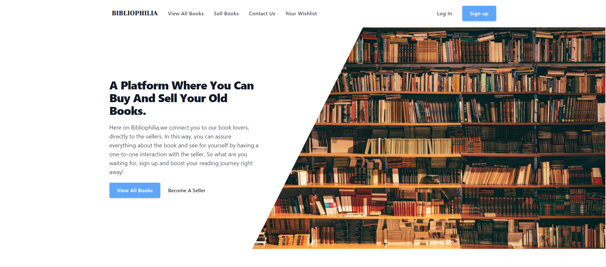

<!-- PROJECT LOGO -->
<br />
<div align="center">
  <a href="https://github.com/Narottam04/Bibliophilia">
    
  </a>

  <h3 align="center">BIBLIOPHILIA</h3>

  <p align="center">
    A Platform Where You Can Buy And Sell Your Old Books.
    <br />
    <a href="https://github.com/Narottam04/Bibliophilia"><strong>Explore repository »</strong></a>
    <br />
    <br />
    <a href="https://bibliophilia.pages.dev/">View Demo</a>
    ·
    <a href="https://github.com/othneildrew/Best-README-Template/issues">Report Bug</a>
    ·
    <a href="https://github.com/othneildrew/Best-README-Template/issues">Request Feature</a>
  </p>
</div>


<!-- ABOUT THE PROJECT -->
## About The Project

<a href="https://github.com/Narottam04/Bibliophilia" >
    
</a>

Here on Bibliophilia,we connect you to our book lovers, directly to the sellers. In this way, you can assure everything about the book and see for yourself by having a one-to-one interaction with the seller. So what are you waiting for, sign up and boost your reading journey right away!

<p align="right">(<a href="#top">back to top</a>)</p>


### Built With

This section should list any major frameworks/libraries used to bootstrap your project. Leave any add-ons/plugins for the acknowledgements section. Here are a few examples.

* React.js
* Firebase Authentication 
* Commerce Js
* Capacitor Js
* Tailwind CSS


<p align="right">(<a href="#top">back to top</a>)</p>

### Installation

_Below is an example of how you can instruct your audience on installing and setting up your app. This template doesn't rely on any external dependencies or services._

1. Get a free API Key at [Commercejs](https://commercejs.com/)


2. Clone the repo
   ```sh
   git clone https://github.com/your_username_/Project-Name.git
   ```
   
3. Install NPM packages
   ```sh
   npm install
   ```
   
4. Create a ".env" file in root of the project and Enter your API 
   ```js
   REACT_APP_CHEC_PUBLIC_KEY=YOUR_API_KEY

   ```
 
<p align="right">(<a href="#top">back to top</a>)</p>


<!-- GETTING STARTED -->
## Getting Started

  ```sh
  npm start 
  ```


